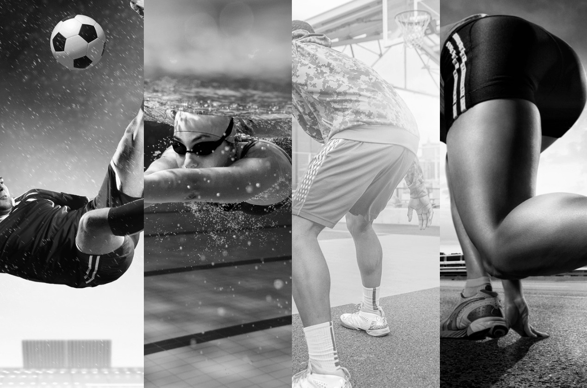

# Painel

Um site com um controle deslizante de imagem com corrida, basquete, futebol e natação.

Mais informações sobre o site:

<a href="https://github.com/vitorborqge/Painel">Acesse por meio deste link</a>

    

🚀 Tecnologias utilizadas

✔️ HTML5 
  

✔️ CSS3 

✔️ JS 
  

  
  Feito por Vitorborqge
